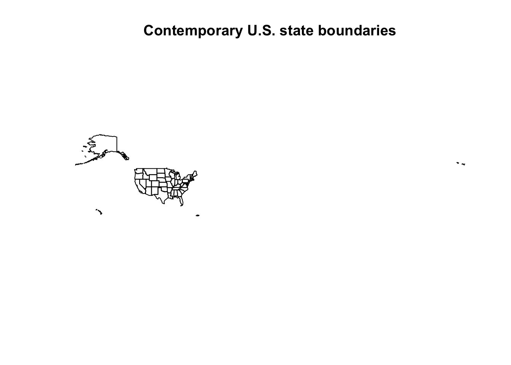
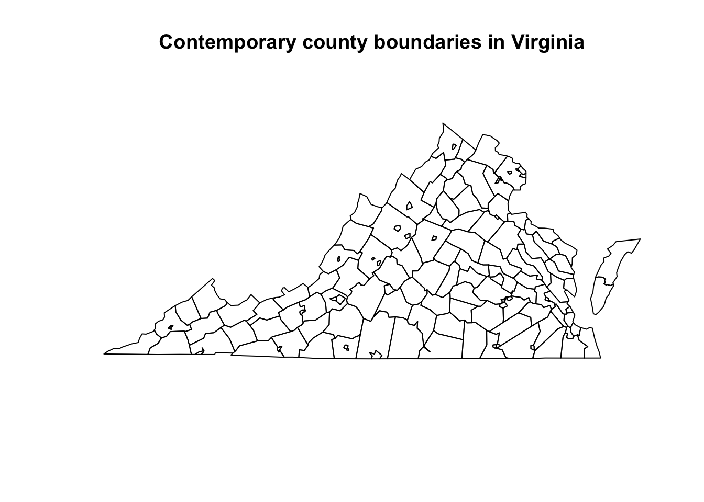
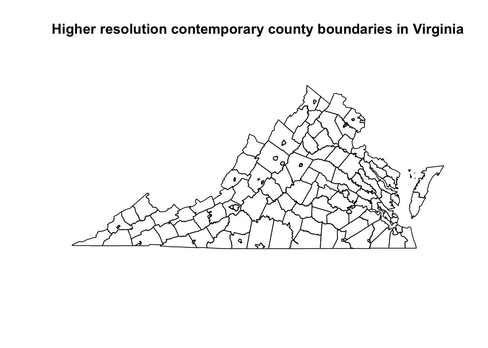
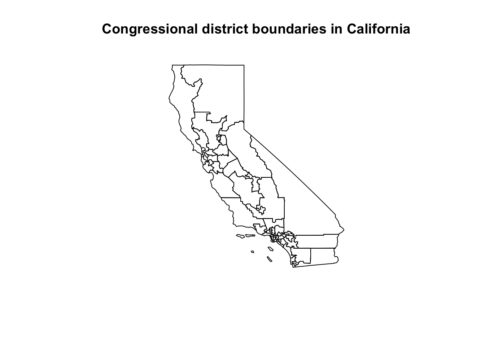
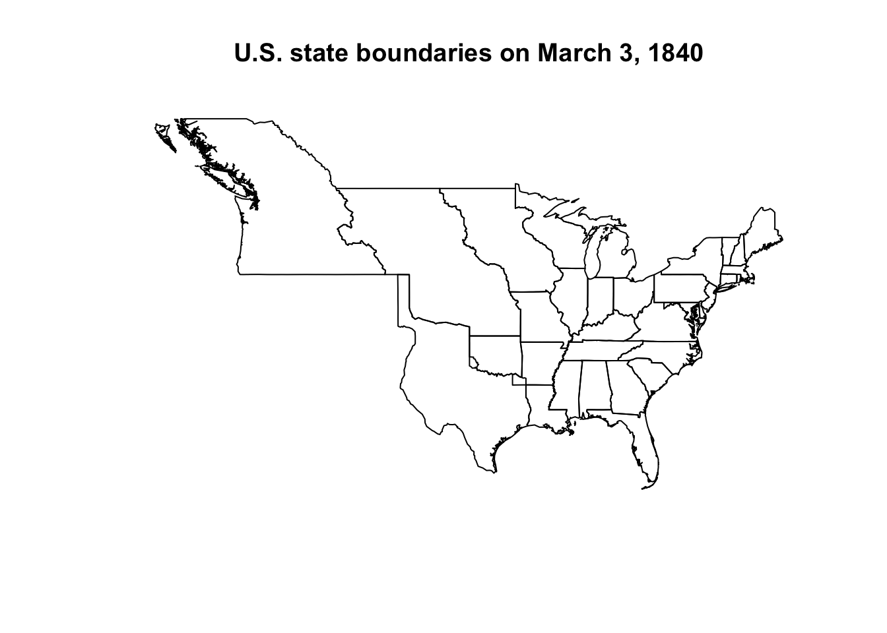

<!-- README.md is generated from README.Rmd. Please edit that file -->
USAboundaries: Historical and Contemporary Boundaries of the United States of America
-------------------------------------------------------------------------------------

[](http://cran.r-project.org/package=USAboundaries) [](https://travis-ci.org/ropensci/USAboundaries) [](https://ci.appveyor.com/project/ropensci/USAboundaries) [](https://codecov.io/github/ropensci/USAboundaries?branch=master)

This R package includes contemporary state, county, and Congressional district boundaries, as well as zip code tabulation area centroids. It also includes historical boundaries from 1629 to 2000 for states and counties from the Newberry Library's [Atlas of Historical County Boundaries](http://publications.newberry.org/ahcbp/), as well as historical city population data from Erik Steiner's "[United States Historical City Populations, 1790-2010](https://github.com/cestastanford/historical-us-city-populations)." The package has some helper data, including a table of state names, abbreviations, and FIPS codes, and functions and data to get [State Plane Coordinate System](https://en.wikipedia.org/wiki/State_Plane_Coordinate_System) projections as EPSG codes or PROJ.4 strings.

### Installation

You can install this package from CRAN.

    install.packages("USAboundaries")

Almost all of the data for this package is provided by the [USAboundariesData package](https://github.com/ropensci/USAboundariesData). That package will be automatically installed (with your permission) from the [rOpenSci package repository](http://packages.ropensci.org/) the first time that you need it.

Or you can install the development versions from GitHub using [devtools](https://github.com/hadley/devtools).

    devtools::install_github("ropensci/USAboundaries")
    devtools::install_github("ropensci/USAboundariesData")

### Use

This package provides a set of functions, one for each of the types of boundaries that are available. These functions have a consistent interface.

Passing a date to `us_states()`, `us_counties()`, and `us_cities()` returns the historical boundaries for that date. If no date argument is passed, then contemporary boundaries are returned. The functions `us_congressional()` and `us_zipcodes()` only offer contemporary boundaries.

For any function, pass a character vector of state names or abbreviations to the `states =` argument to return only those states or territories.

For certain functions, more or less detailed boundary information is available by passing an argument to the `resolution =` argument.

See the examples below to see how the interface works, and see the documentation for each function for more details.

``` r
library(USAboundaries) 
library(sf) # for plotting and projection methods
#> Linking to GEOS 3.6.1, GDAL 2.1.3, proj.4 4.9.3

states_1840 <- us_states("1840-03-12")
plot(st_geometry(states_1840))
title("U.S. state boundaries on March 3, 1840")
```


``` r

states_contemporary <- us_states()
plot(st_geometry(states_contemporary))
title("Contemporary U.S. state boundaries")
```



``` r

counties_va_1787 <- us_counties("1787-09-17", states = "Virginia")
plot(st_geometry(counties_va_1787))
title("County boundaries in Virginia in 1787")
```


``` r

counties_va <- us_counties(states = "Virginia")
plot(st_geometry(counties_va))
title("Contemporary county boundaries in Virginia")
```



``` r

counties_va_highres <- us_counties(states = "Virginia", resolution = "high")
plot(st_geometry(counties_va_highres))
title("Higher resolution contemporary county boundaries in Virginia")
```



``` r

congress <- us_congressional(states = "California")
plot(st_geometry(congress))
title("Congressional district boundaries in California")
```



### State plane projections

The `state_plane()` function returns EPSG codes and PROJ.4 strings for the State Plane Coordinate System. You can use these to use suitable projections for specific states.

``` r
va <- us_states(states = "VA", resolution = "high")
plot(st_geometry(va), graticule = TRUE)
```



``` r

va_projection <- state_plane("VA")
va <- st_transform(va, va_projection)
plot(st_geometry(va), graticule = TRUE)
```


### Related packages

Each function returns an `sf` object from the [sf](http://cran.r-project.org/package=sf) package, which can be mapped using the [leaflet](http://cran.r-project.org/package=leaflet) or [ggplot2](http://cran.r-project.org/package=ggplot2) packages.

If you need U.S. Census Bureau boundary files which are not provided by this package, consider using the [tigris](http://cran.r-project.org/package=tigris) package, which downloads those shapefiles.

### Citation and license

The historical boundary data provided in this package is available under the CC BY-NC-SA 2.5 license from John H. Long, et al., [Atlas of Historical County Boundaries](http://publications.newberry.org/ahcbp/), Dr. William M. Scholl Center for American History and Culture, The Newberry Library, Chicago (2010). Please cite that project if you use this package in your research and abide by the terms of their license if you use the historical information.

The historical population data for cities is provided by U.S. Census Bureau and Erik Steiner, Spatial History Project, Center for Spatial and Textual Analysis, Stanford University. See the data in [this repository](https://github.com/cestastanford/historical-us-city-populations).

The contemporary data is provided by the [U.S. Census Bureau](https://www.census.gov/geo/maps-data/) and is in the publication domain.

All code in this package is copyright [Lincoln Mullen](http://lincolnmullen.com) and is released under the MIT license.

If you use this package in your research, I would appreciate a citation.

``` r
citation("USAboundaries")
#> 
#> To cite package 'USAboundaries' in publications use:
#> 
#>   Lincoln Mullen and Jordan Bratt (2016). USAboundaries:
#>   Historical and Contemporary Boundaries of the United States of
#>   America. R package version 0.3.0.
#>   https://github.com/ropensci/USAboundaries
#> 
#> A BibTeX entry for LaTeX users is
#> 
#>   @Manual{,
#>     title = {USAboundaries: Historical and Contemporary Boundaries of the United States of America},
#>     author = {Lincoln Mullen and Jordan Bratt},
#>     year = {2016},
#>     note = {R package version 0.3.0},
#>     url = {https://github.com/ropensci/USAboundaries},
#>   }
```

------------------------------------------------------------------------

[](http://ropensci.org)
